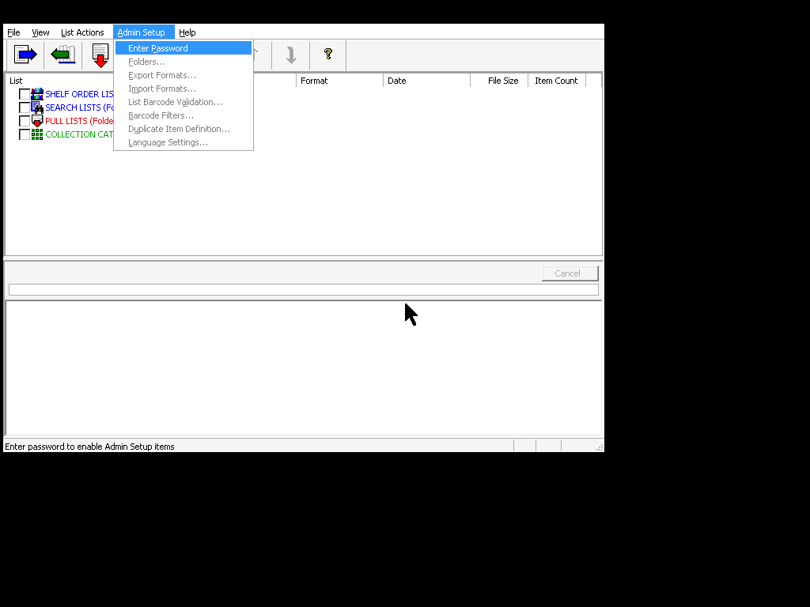
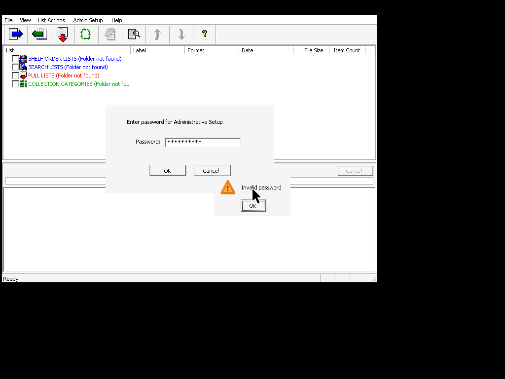
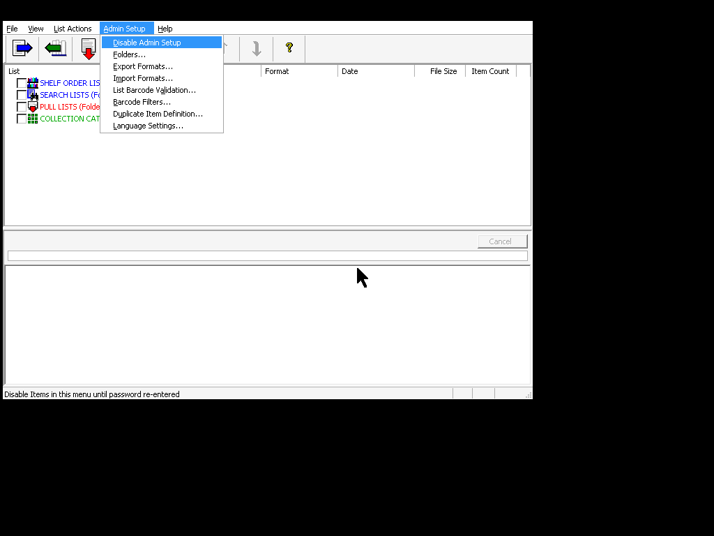
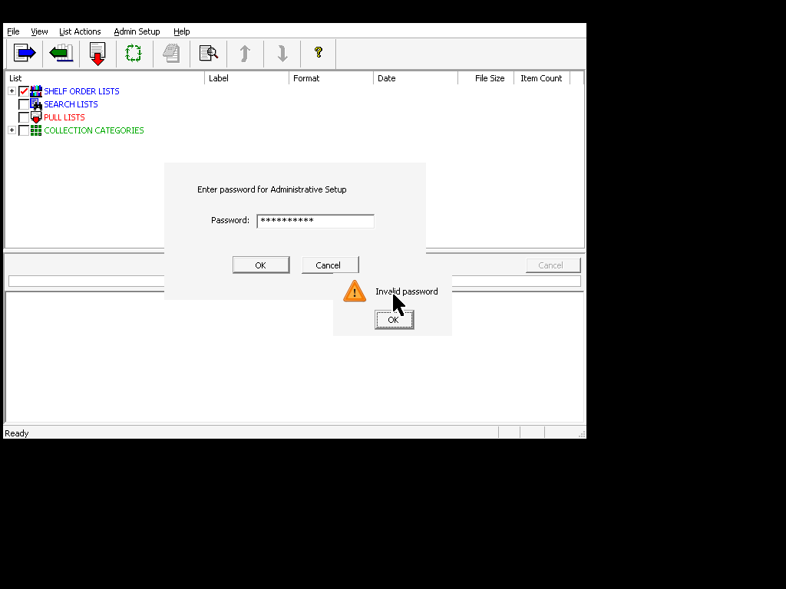
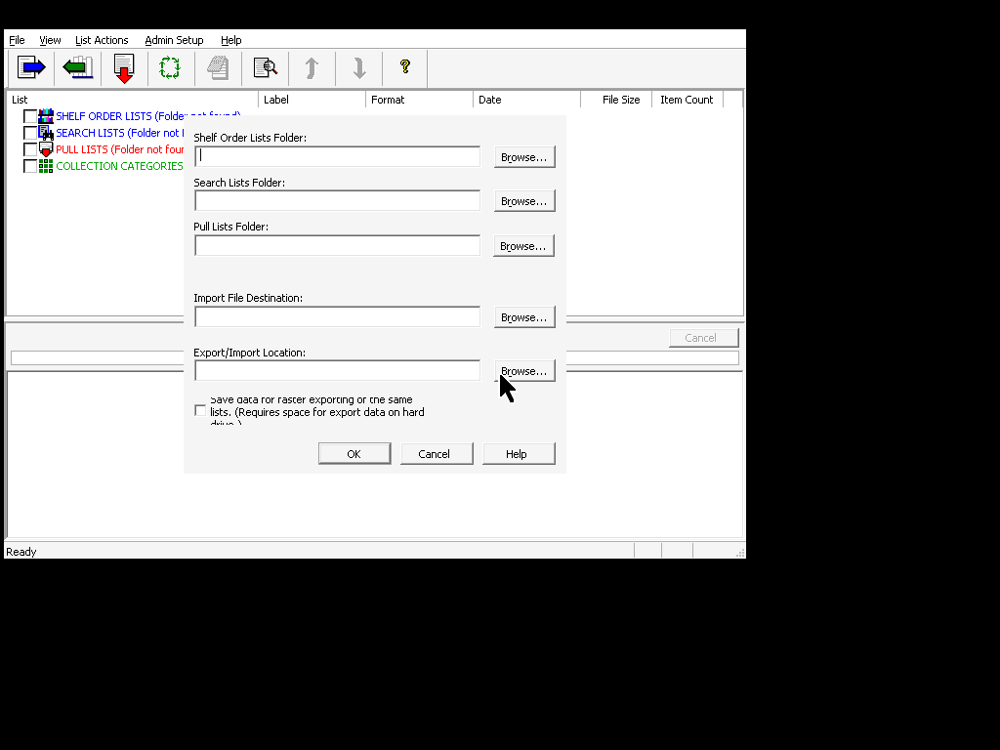
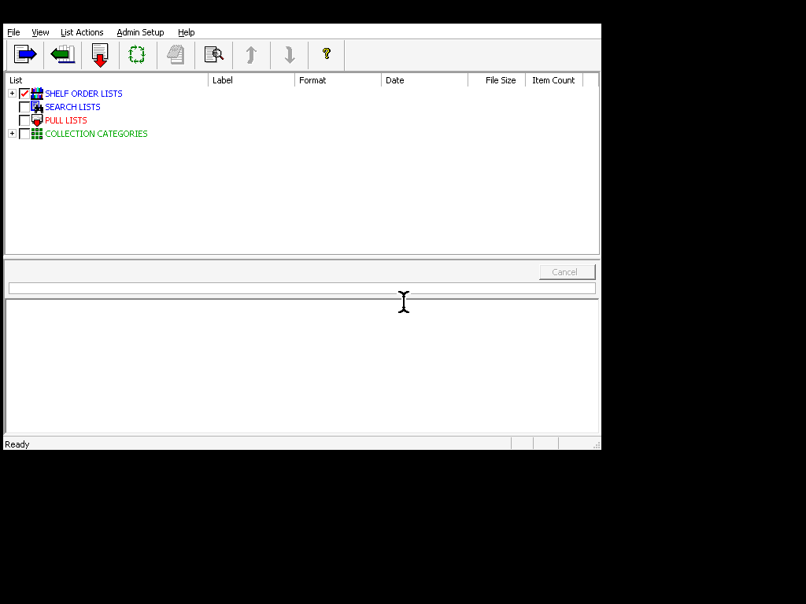
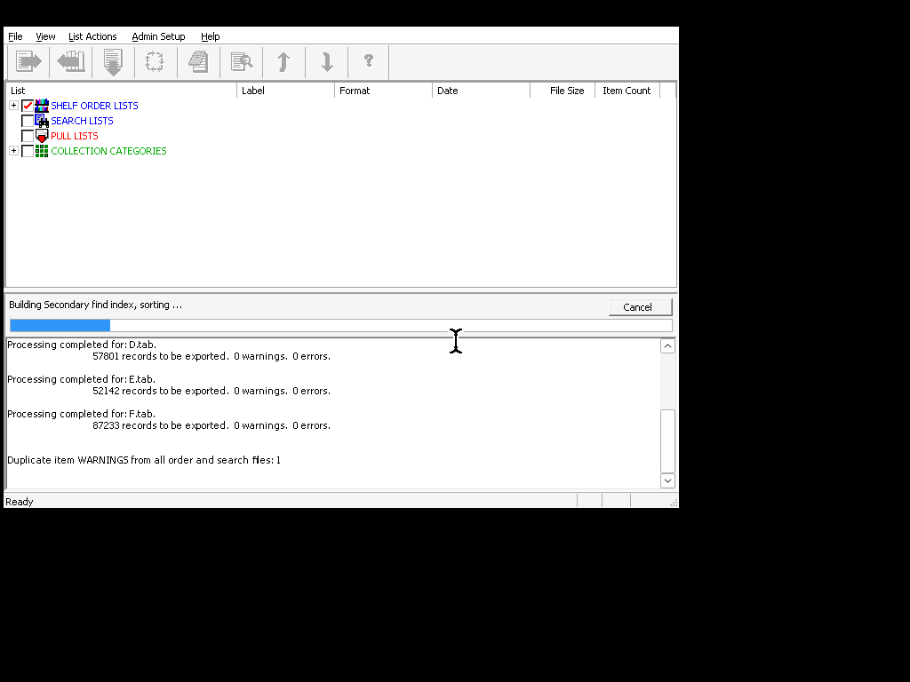
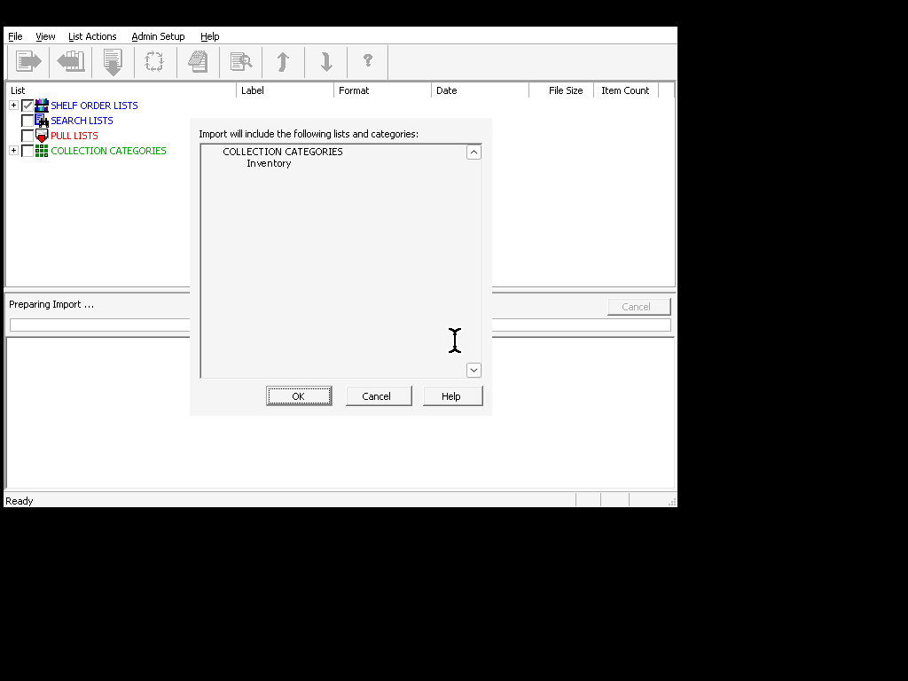
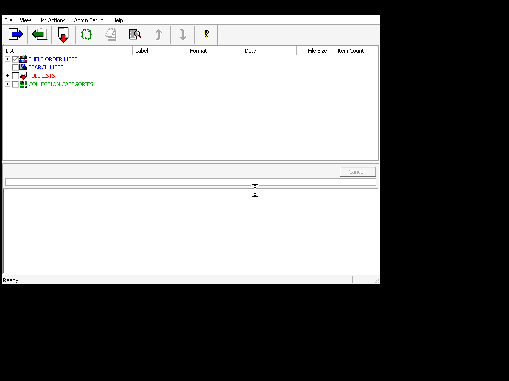
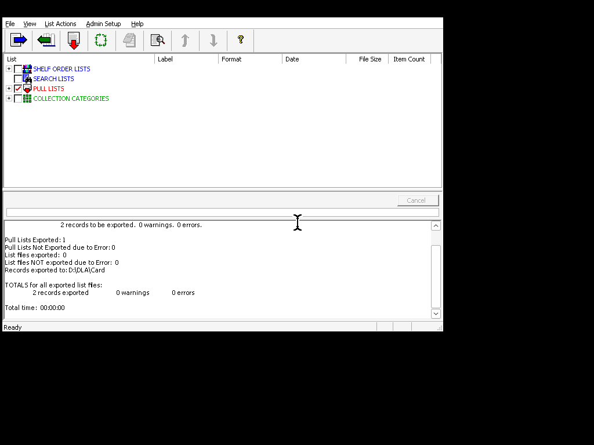

# 3M(TM) Digital Data Manager & Digital Library Assistant (DLA) - Operations & Deployment Guide

This guide describes how to deploy, configure, and operate the original **3M(TM) Digital Data Manager** software on a new Windows environment, using the original administrative access controls and directory configurations for compiling database catalogs for the **3M(TM) Digital Library Assistant (DLA)** handheld reader.

---

## 1. System Requirements & Registry Configuration

Before running the **Digital Data Manager** client (`DataManager.exe`) on a new Windows machine or clean Wine environment, you must configure the environment with validation parameters and folder structures.

### Registry Setup
Create a `.reg` file containing the following settings to validate barcodes and bypass software checks:

```registry
Windows Registry Editor Version 5.00

; Define Handheld Software Installation Path
[HKEY_LOCAL_MACHINE\SOFTWARE\3M\Library Systems\DLA]
"Install"="C:\\Program Files\\3M Library Systems\\DLA"

; Configure Barcode Validation Parameters
[HKEY_LOCAL_MACHINE\SOFTWARE\3M\Library Systems\Data Manager\3.00\BCValidation]
"MinLength"=dword:0000000a
"MaxLength"=dword:0000000a
"Digit Characters"=dword:00000001
"Upper Case Characters"=dword:00000000
"Lower Case Characters"=dword:00000000
"Other Characters"=dword:00000000
```

### Handheld Installation Binaries
The Digital Data Manager application checks the DLA installation path resolved in the registry for the PalmOS handheld binaries that get loaded onto the DLA reader card during export. If these files are not present, it will throw a *"DLA Software not installed"* warning and block execution.

These are the actual PalmOS program binaries, which are located in the following relative directory structures of the card installer folder (found on a running system or backup card layout):
*   `Install/dla.prc`
*   `Install/exe/dla_app.prc`
*   `Install/FlashPro.prc`
*   `Install/3MLS_CDI.prc`

Ensure these files are copied from your card backup to the host installation path resolved in the registry (by default: `C:\Program Files\3M Library Systems\DLA\`).

---

## 2. Administrator Access & Authentication

To adjust directory paths, validation constraints, or format definitions, you must authenticate as an administrator.

### Step 1: Open Admin Setup
In the main window menu bar, click **Admin Setup** and select **DLA Category/Folders...**:



### Step 2: Input Admin Password
The software will prompt you with an authorization dialog:



Enter the factory-set administrative password:
```text
technician
```



Press **Return** or click **OK** to authenticate. The configuration fields will now unlock for editing:



---

## 3. Directory Configuration

Once authenticated, you will be presented with the **DLA Category and Folders** dialog:



### Parameters to Set:
1.  **DLA Category/Format:** Ensure the active category is set to `"Default"` (for standard library workflows) or `"Inventory"`.
2.  **Upload/Download Folders:**
    *   **Lists Directory:** Path where the source `.tab` delimited files exported from the ILS (e.g. Koha) are placed (e.g. `D:\DLA\ShelfOrderList\`).
    *   **Export/Data Directory:** Destination path where the compiled PalmOS `.pdb` database catalogs and search mappings are written (e.g. `D:\DLA\Card\`).

Confirm settings. A success popup should confirm validation:



---

## 4. Compiling and Exporting Catalogs

The application continuously monitors the lists directory. Follow these operational steps to build handheld catalogs:

### Step 1: Refresh Monitored Lists
Press **F5** or select the refresh option to scan the lists folder. The tree view will populate under `SHELF ORDER LISTS`.



### Step 2: Check Lists for Export
Double-click or check the checkbox next to the lists (floors) you wish to compile. 

### Step 3: Trigger Export Compilation
1.  Select **File** -> **Export...** from the menu (or press **Alt+F**, then **E**).
2.  In the confirmation dialog, press **Return** or click **OK**.
3.  The application will start building the primary indexes, sorting data, and compiling search indexes. A progress bar will show "Building Secondary find index, sorting...".
4.  Once completed, it will write the database structure under the target directory:
    *   `000-3MLH.pdb`: Master segments lookup list.
    *   `id01/001-3MLH.pdX` (and subsequent segments): Barcode indexes (dynamic 14/16-byte records depending on item count).
    *   `md01/001d-3MLH.pdb` (and subsequent segments): Book details (Titles & Callnumbers).
    *   `ndex/3F3F4431/` and `ndex/3F3F4432/`: Title and Callnumber search indexes.

---

## 5. Importing Scans from Handheld Device

To retrieve and parse scanned inventory/pull lists uploaded from the DLA handheld reader:

### Step 1: Copy scan files from memory card
Ensure the upload `.pdX` files from the handheld reader are present in the `upload/inv/` or `upload/coll/` subdirectory of your configured **Export/Import Location** (e.g. `D:\DLA\Card\upload\inv\001.pdX`).

### Step 2: Trigger Import
1. Select **File** -> **Import** from the menu (or press **Alt+F**, then **I**).
2. The application will scan the folder and display a list confirmation dialog detailing which categories and lists are being imported:



3. Press **Return** or click **OK** to start the import process.

### Step 3: View Results and Reports
The application parses the scanned records and validates them against the active catalog database. It updates statistics in the logging log window and exports a clean barcode text file containing the scanned barcode list to your configured **Import File Destination** (e.g. `D:\DLA\Import\Inventory\Inventory MM-DD-YY (count).txt`):


---

## 6. Compiling Pull Lists

In addition to shelf order list catalogs, the system supports hold/pull lists. Pull lists are loaded onto the DLA reader device to help staff locate specific items on the shelf.

### Step 1: Create a Pull List text file
Create a tab-delimited text file (e.g. `pull1.tab`) with the format:
`Barcode \t Callnumber \t Title`

Place this file inside the configured **Pull Lists Folder** (e.g., `D:\DLA\PullList\`). 

Once placed, the main interface will recognize the file and load it under **PULL LISTS** (which has a dedicated red color scheme in the user interface):



### Step 2: Trigger Pull List Export
1. In the database management interface, select the pull list checkboxes you want to export (and deselect any regular shelf lists).
2. Select **File** -> **Export...** from the menu (or press **Alt+F**, then **E**).
3. The legacy client compiles the pull list and outputs it into the `pull/` folder at the root of the CompactFlash memory card (e.g., `pull/PL001.pdb`) along with the central pull list index file (`pull/PL000.tmp`):



### Step 3: Load and Process on Handheld Reader
The compiled database `pull/PL*.pdb` and its central index `pull/PL000.tmp` are copied onto the CompactFlash memory card. The handheld DLA reader automatically reads `PL000.tmp` on boot to populate the pull list menu on the touch screen, and then loads the selected `PL*.pdb` database.

During shelf reading:
1. Select the pull list from the DLA menu.
2. Scan the shelves. When an item matching a barcode in the active pull list is found, the DLA emits a rapid series of high-toned beeps.
3. The librarian removes the item from the shelf and presses the **Pulled** button on the DLA touch screen. This action **removes/deletes the record** from the `PL*.pdb` file on the card (or marks it as deleted in PalmOS metadata).

### Step 4: Import Results
Once pulling is finished, the memory card is re-inserted into the workstation PC. Inside **Digital Data Manager**, click the green **Import** icon. 

Data Manager reads the modified `PL*.pdb` databases from the card and compares them against its local database record. Because the DLA deleted records of pulled items:
*   Any item originally in the list but **missing** in the card's `PL*.pdb` is flagged as **Pulled**.
*   Any item still **present** in the card's `PL*.pdb` is flagged as **Not Pulled**.

The application automatically compiles two output files inside your configured **Import File Destination** folder:
1.  **Pulled (+) File:** Named `<ListName> <MM-DD-YY> (+ <count>) <uniq>.plr` (contains one barcode per line of found items).
2.  **Not Pulled (-) File:** Named `<ListName> <MM-DD-YY> (- <count>) <uniq>.plr` (contains one barcode per line of unfound items).

Librarians can use the **Pulled (+)** text file to batch-update hold statuses in the Koha ILS.

> [!TIP]
> **Native Alternative (`dla_tool.py`):**
> You can perform this same diff analysis natively under Linux without running the legacy Windows application by running:
> ```bash
> python3 dla_tool.py import-pull original_list.tab Card/pull/PL001.pdb output_results
> ```
> This will generate `output_results_pulled.txt` and `output_results_not_pulled.txt` natively.

---

## 7. 3M Product Reference Manuals

The original documentation PDF manuals are located on the system at the following paths:

### Workstation PC Installation Location:
*   `C:\Program Files\3M Library Systems\Data Manager\Exe\DataFormatGuide_v3_00.pdf` (Barcode formats and list layout guidelines)
*   `C:\Program Files\3M Library Systems\Data Manager\Exe\DataManager_Admin_v3_00.pdf` (Administrator configuration setup)
*   `C:\Program Files\3M Library Systems\Data Manager\Exe\DataManager_Staff_v3_00.pdf` (Staff import/export operations)
*   `C:\Program Files\3M Library Systems\DLA\Docs\DLA_User_Guide.pdf` (DLA device menu and usage)
*   `C:\Program Files\3M Library Systems\DLA\Docs\Handheld_User_Guide.pdf` (Handheld operations reference)

### Memory Card Backup Location:
*   `Install/Docs/DLA_User_Guide.pdf` (Portable PDF manual on CompactFlash)
*   `Install/Docs/Handheld_User_Guide.pdf`
*   `Install/Docs/Handheld_User_Guide_702_802.pdf`
